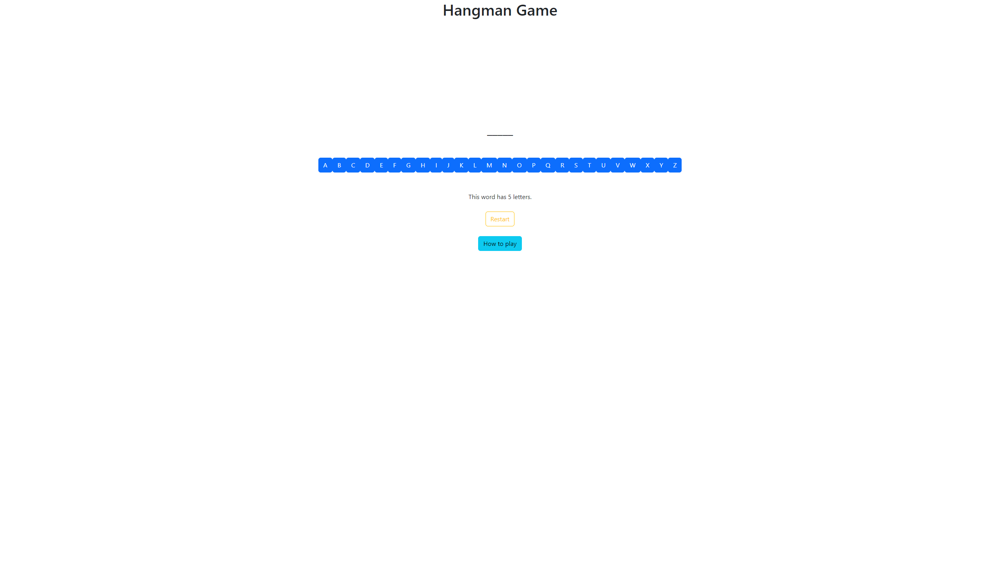
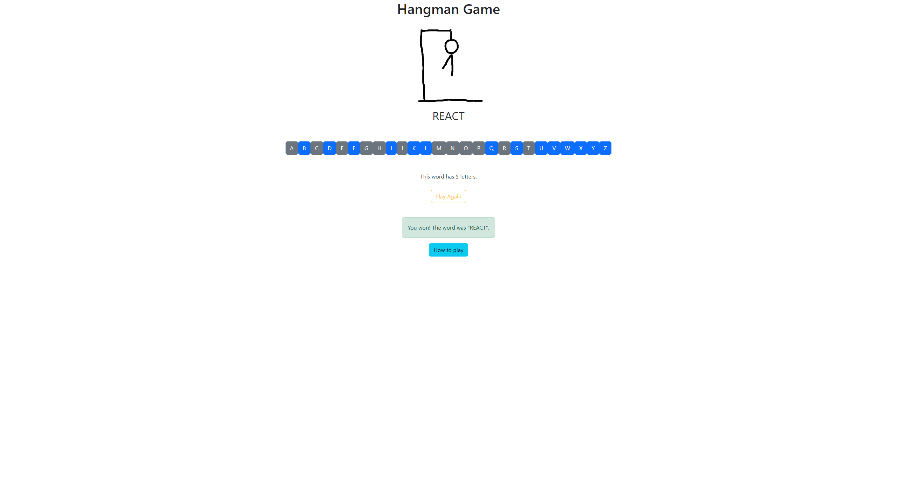
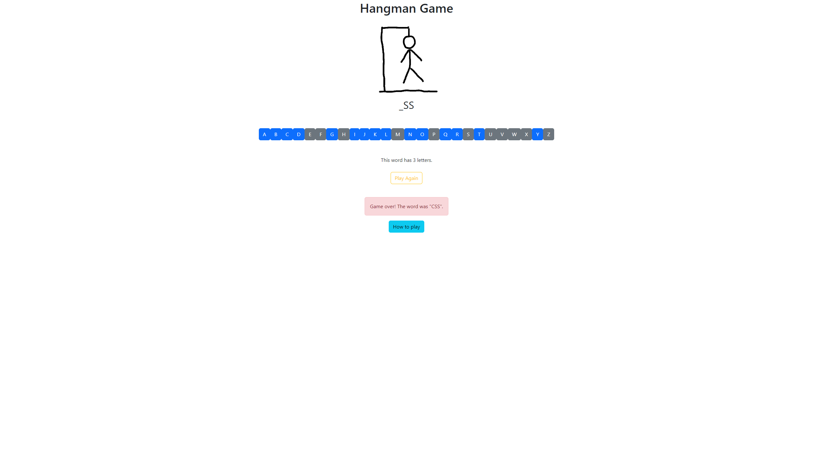
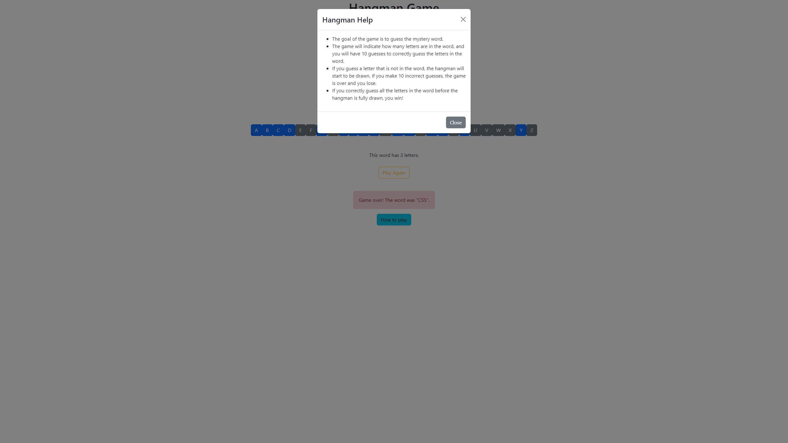

# Hangman Game

## Description

This is a Hangman game made with React. The game randomly selects a word from a predefined list of words, and the player tries to guess the word by suggesting letters. The player has a limited number of attempts to guess the word, and each incorrect guess results in a part of a hangman being drawn. If the player runs out of attempts, the game is over, and the word is revealed. If the player guesses the word correctly, the player wins the game.

## Table of Contents

1. [How to Play](#how-to-play)
2. [Screenshots](#screenshots)
3. [Getting Started](#getting-started)
4. [Credits](#credits)

## How to Play

- Click on the letters to suggest them.
- You can only suggest letters that have not been suggested before.
- You can only suggest letters if the game is not over, and you have not won the game.
- If you guess the word correctly, you win the game.
- If you run out of attempts before guessing the word, you lose the game.

## Screenshots

## Getting Started

To run the game locally, follow these steps:

### Prerequisites

- Node.js (v14 or higher)
- React (v18 or higher)

### Installation

1. Clone the repository to your local machine using the command **git clone** https://github.com/silviucoler/Hangman-Game.git
2. Navigate to the project directory using the command **cd Hangman-Game**
3. Install the necessary dependencies using the command **npm install**
4. Start the local development server using the command **npm start**

### Usage

Once the local development server is running, access the game in your browser at http://localhost:3000.

## Credits

This personal site was developed by me as a solo project for HyperionDev bootcamp. However, if you would like to contribute to the project or suggest any changes, feel free to create a pull request.
